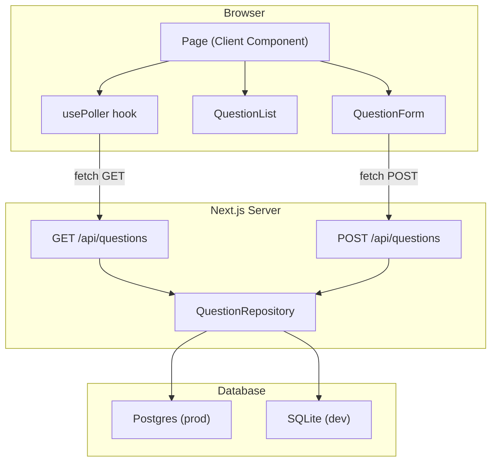

# Design Document: TTG QA App

## Overview

TTG QA is a real-time classroom Q&A web application built with Next.js (App Router) and TypeScript. Students open a single page, submit questions via a form, and see all questions—newest first—continuously updated through client-side polling.

The application runs entirely within a Next.js project:

- **Pages / UI**: React Server Components and Client Components under `app/`
- **API layer**: Next.js Route Handlers under `app/api/questions/`
- **Persistence**: Postgres in production, SQLite in local development—both accessed via a thin repository abstraction

The polling interval is ≤ 5 seconds (measured from response completion), ID-based deduplication prevents duplicates, and the poller backs off and shows a manual retry button after 6 consecutive failures.

---

## Architecture



**Key architectural decisions:**

1. **Route Handlers instead of Pages API** — Next.js App Router route handlers (`app/api/questions/route.ts`) are the idiomatic choice and support edge/Node runtimes cleanly.
2. **Repository pattern** — A `QuestionRepository` interface with two concrete implementations (`PostgresQuestionRepository`, `SQLiteQuestionRepository`) keeps the API layer database-agnostic and testable.
3. **Client-side polling over WebSockets/SSE** — Simple to implement and operate; the 5-second interval is sufficient for a classroom setting without adding infrastructure complexity.
4. **No global state library** — React `useState` + `useEffect` in a custom `usePoller` hook handles all real-time state; the app is small enough that Redux/Zustand is unnecessary overhead.

---

## Components and Interfaces

### Page component (`app/page.tsx`)

Top-level Client Component that owns question list state and wires `QuestionForm`, `QuestionList`, and `usePoller` together.

```typescript
// Owned state
questions: Question[]          // current deduplicated list
loadingInitial: boolean        // true only on first fetch
fetchError: string | null      // last fetch error message
hasPriorData: boolean          // true once at least one successful fetch has populated the list
```

### `QuestionForm` component

Controlled form with:
- `questionText` (max 500 chars) — required
- `author` (max 100 chars) — optional
- Client-side validation before fetch
- Submission state: idle | submitting | success | error
- On success: clears `questionText`, calls `onSubmitted(newQuestion)` callback to inject the new question at the top of the list without waiting for the next poll

**Props:**
```typescript
interface QuestionFormProps {
  onSubmitted: (question: Question) => void;
}
```

### `QuestionList` component

Pure display component. Renders loading skeleton, empty state, error banners, and the question cards.

**Props:**
```typescript
interface QuestionListProps {
  questions: Question[];
  loading: boolean;
  error: string | null;
  hasPriorData: boolean;
}
```

### `QuestionCard` component

Renders a single question: text, formatted timestamp (locale string), and author (fallback "Anonymous").

### `usePoller` hook

```typescript
function usePoller(options: {
  onQuestions: (questions: Question[]) => void;
  onError: (err: string) => void;
  onStopped: () => void;
  intervalMs?: number;        // default 5000
  maxConsecutiveFailures?: number; // default 6
}): { stopped: boolean; restart: () => void }
```

Internals:
1. After each successful or failed fetch, schedules the next via `setTimeout` (not `setInterval`) so the interval is measured from **response completion**.
2. Tracks `consecutiveFailures`; at 6 it calls `onStopped()` and cancels the timer.
3. `restart()` resets the counter and resumes polling.
4. Cleans up on unmount via `useEffect` cleanup.

### API Route Handlers

**`GET /api/questions`** (`app/api/questions/route.ts`)

```
Response: 200 Question[]   (ordered timestamp DESC, empty array if none)
Response: 503              (database unavailable)
```

**`POST /api/questions`** (`app/api/questions/route.ts`)

```
Request body: { text: string; author?: string }
Response: 201 Question     (created record)
Response: 400              (missing/empty/overlimit text, malformed body)
Response: 503              (database unavailable)
```

### `QuestionRepository` interface

```typescript
interface QuestionRepository {
  findAll(): Promise<Question[]>;                     // ordered timestamp DESC
  create(data: CreateQuestionDTO): Promise<Question>;
}

interface CreateQuestionDTO {
  text: string;
  author: string | null;
}
```

Two implementations selected at startup via `NODE_ENV` / `DATABASE_URL`:
- `PostgresQuestionRepository` — uses `pg` (node-postgres)
- `SQLiteQuestionRepository` — uses `better-sqlite3` wrapped in a promise adapter

---

## Data Models

### `Question` (shared TypeScript type)

```typescript
export interface Question {
  id: string;        // UUID v4, server-generated
  text: string;      // 1–500 characters
  author: string | null; // null when not provided
  timestamp: string; // ISO 8601 UTC, e.g. "2024-06-01T12:00:00.000Z"
}
```

### Database Schema

```sql
CREATE TABLE questions (
  id        TEXT        PRIMARY KEY,          -- UUID v4
  text      TEXT        NOT NULL,             -- max 500 chars enforced at API layer
  author    TEXT,                             -- nullable
  timestamp TIMESTAMPTZ NOT NULL DEFAULT NOW() -- Postgres; SQLite uses TEXT ISO8601
);
```

> For SQLite, `TIMESTAMPTZ` is stored as `TEXT` in ISO 8601 format. The repository layer normalises the value to a UTC ISO string before returning it to the API.

### API Request / Response Shapes

**POST request body:**
```json
{ "text": "What is a closure?", "author": "Alice" }
```

**201 response (and polling GET array element):**
```json
{
  "id": "550e8400-e29b-41d4-a716-446655440000",
  "text": "What is a closure?",
  "author": "Alice",
  "timestamp": "2024-06-01T12:00:00.000Z"
}
```

**400 error response:**
```json
{ "error": "text is required and must be between 1 and 500 characters" }
```

**503 error response:**
```json
{ "error": "Service temporarily unavailable. Please try again shortly." }
```

---

## Correctness Properties

*A property is a characteristic or behavior that should hold true across all valid executions of a system — essentially, a formal statement about what the system should do. Properties serve as the bridge between human-readable specifications and machine-verifiable correctness guarantees.*

### Property 1: Question submission round-trip

*For any* valid question submission (non-empty text ≤ 500 chars, optional author ≤ 100 chars), the object returned by `POST /api/questions` SHALL contain the same `text` and `author` values that were submitted, plus a non-empty UUID `id` and a valid UTC ISO 8601 `timestamp`, with HTTP status 201.

**Validates: Requirements 1.3, 1.6, 4.3**

---

### Property 2: GET returns all persisted questions, newest first

*For any* sequence of question submissions, `GET /api/questions` SHALL return an array containing exactly those questions (by `id`), ordered so that for every adjacent pair `[q_i, q_{i+1}]`, `q_i.timestamp >= q_{i+1}.timestamp`.

**Validates: Requirements 2.2, 4.2**

---

### Property 3: Invalid text is rejected at client and API

*For any* string that is empty (or whitespace-only) or exceeds 500 characters: (a) the client-side validation function SHALL return `isValid: false` and an error message, preventing a POST request; and (b) if such a value reaches the API directly, the route handler SHALL return HTTP status 400 with an `error` field.

**Validates: Requirements 1.4, 1.5, 4.4**

---

### Property 4: Null author stored and returned correctly

*For any* question submitted with an absent, empty, or null author, the stored question SHALL have a `null` author, and all subsequent `GET /api/questions` responses SHALL return that question with `"author": null`.

**Validates: Requirements 1.8, 4.1**

---

### Property 5: Poller deduplication preserves list integrity

*For any* existing question list and any incoming poll response (which may partially or fully overlap the existing IDs), the merged list SHALL contain each question ID exactly once, and the relative order of questions that were already in the list SHALL be unchanged.

**Validates: Requirements 3.2**

---

### Property 6: Question card displays all required fields

*For any* `Question` object (with any text, any timestamp, and author either a non-empty string or null), the rendered `QuestionCard` SHALL contain the question `text`, a formatted representation of the `timestamp`, and either the `author` value or the string "Anonymous" when author is null.

**Validates: Requirements 2.3**

---

### Property 7: Poller stops after N consecutive failures

*For any* number of consecutive fetch failures n ≥ 6, the `usePoller` hook SHALL cease scheduling further poll requests and SHALL invoke the `onStopped` callback, which causes the UI to display a manual retry button.

**Validates: Requirements 3.5**

---

### Property 8: Form resets after successful submission

*For any* valid question submission that the API acknowledges with a 201 response, the `QuestionForm` SHALL clear the question text input field, re-enable the submit button, and restore its default label.

**Validates: Requirements 5.4**

---

## Error Handling

### API Layer

| Condition | Status | Body |
|---|---|---|
| `text` missing / empty / > 500 chars | 400 | `{ error: "..." }` |
| Malformed JSON or wrong Content-Type | 400 | `{ error: "Invalid request body" }` |
| Database connection failure | 503 | `{ error: "Service temporarily unavailable..." }` |
| Unexpected server error | 500 | `{ error: "Internal server error" }` |

All errors are caught in a top-level try/catch inside each route handler. Database errors are detected by catching connection/query exceptions and mapping them to 503. Unknown errors fall through to 500.

### Client — Submission

- Network error or non-2xx response: display error message below the form, re-enable the submit button so the student can retry.
- 503 specifically: show "Submission failed — the server is temporarily unavailable."
- 400: show the `error` field from the response body adjacent to the relevant field.

### Client — Polling

- Any network/fetch error: increment `consecutiveFailures`, display a non-blocking connectivity banner ("Connection interrupted — retrying…") visible at the top of the page without scrolling.
- After 6 consecutive failures: stop polling, replace connectivity banner with "Connection lost. [Retry]" button.
- On successful fetch after failures: reset `consecutiveFailures` to 0, clear the connectivity banner.
- If a poll response returns an error AND prior data exists: retain existing list, show non-blocking banner (Requirement 2.5).
- If a poll response returns an error AND no prior data: show full-page error state (Requirement 2.6).

---

## Testing Strategy

### Unit Tests

Framework: **Jest** + **React Testing Library**

Focused on:
- `QuestionForm`: client-side validation (empty text, over-limit text, whitespace-only), submission state transitions (idle → submitting → success/error), field clearing on success, disabled button during submission.
- `QuestionList`: loading indicator rendering, empty state, error state with/without prior data, correct display of text/timestamp/author/"Anonymous".
- `usePoller`: consecutive failure counter, stop-at-6 behaviour, restart, cleanup on unmount.
- `QuestionRepository` implementations: CRUD operations against an in-memory SQLite database (`:memory:`) using `better-sqlite3`.
- API route handlers: mocked repository responses, correct HTTP status codes and body shapes for all success and error paths.

### Property-Based Tests

Framework: **fast-check** (TypeScript-native, integrates with Jest)

Each property test runs a **minimum of 100 iterations**. Tests are tagged with a comment in the format:
`// Feature: ttg-qa-app, Property N: <property text>`

| Property | Test description |
|---|---|
| **Property 1** | Generate arbitrary valid `{ text, author }` pairs; call the POST handler with a mock repo; assert HTTP 201, response body contains same text/author, a UUID `id`, and a parseable ISO 8601 UTC timestamp. |
| **Property 2** | Generate arbitrary arrays of questions with random timestamps; insert all via the repository; call `findAll()`; assert result is sorted by timestamp descending. |
| **Property 3** | Generate invalid text values (empty string, whitespace-only strings, strings longer than 500 chars); (a) call client-side validator — assert `isValid: false`; (b) call POST handler directly — assert HTTP 400 and `error` field present. |
| **Property 4** | Generate valid texts with null/undefined/empty author; POST then GET; assert returned `author === null`. |
| **Property 5** | Generate arbitrary existing question lists and incoming poll arrays with overlapping IDs; apply the deduplication merge function; assert no duplicate IDs and existing relative order is preserved. |
| **Property 6** | Generate random `Question` objects with varying text, timestamp, and nullable author; render `QuestionCard`; assert rendered output contains the text, a timestamp string, and either the author value or "Anonymous". |
| **Property 7** | Generate n ≥ 6 consecutive failures; simulate that many failed fetches in `usePoller`; assert `onStopped` was called and no further fetch is scheduled. |
| **Property 8** | Generate arbitrary valid question submissions; simulate a 201 API response; assert form text field is cleared, button is enabled, and button label is restored to default. |

### Integration Tests

Framework: **Jest** with a real SQLite (`:memory:`) database wired to the API route handlers.

Covers:
- End-to-end POST → GET round trip: submitted question appears in subsequent GET response.
- GET returns empty array when no questions exist.
- GET returns questions ordered by timestamp descending when multiple exist.
- 503 path: repository throws a connection error; route handler returns 503.

### Accessibility Testing

- **Automated**: `jest-axe` on rendered `QuestionForm` and `QuestionList` components — enforces ARIA label coverage, button roles, and contrast requirements.
- **Manual / CI**: Lighthouse CI (`@lhci/cli`) in the CI pipeline targeting the accessibility score ≥ 90 (Requirement 5.6).

### Responsive Layout

- Visual regression or manual testing across 320 px, 768 px, 1280 px, and 1920 px viewports.
- Automated: `@testing-library/user-event` smoke tests to verify no horizontal scroll at 320 px viewport width.
